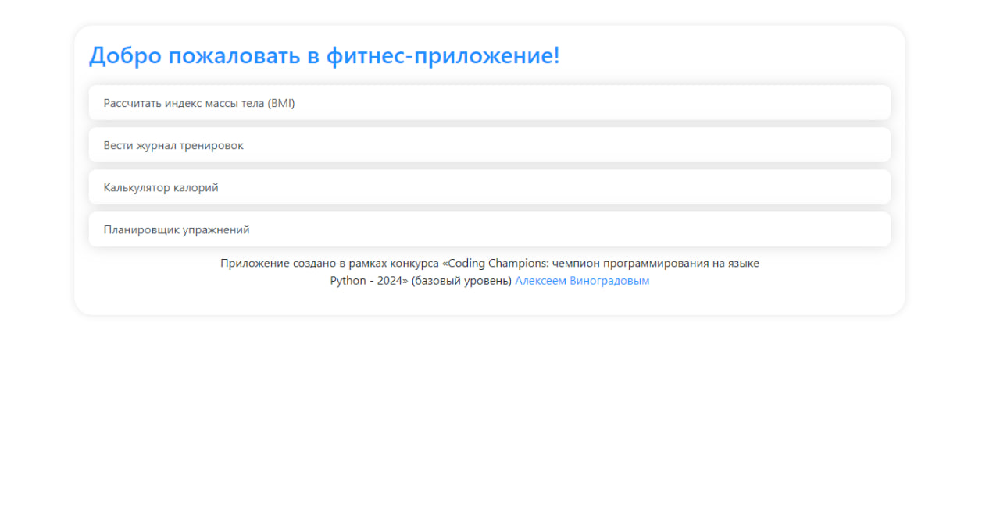
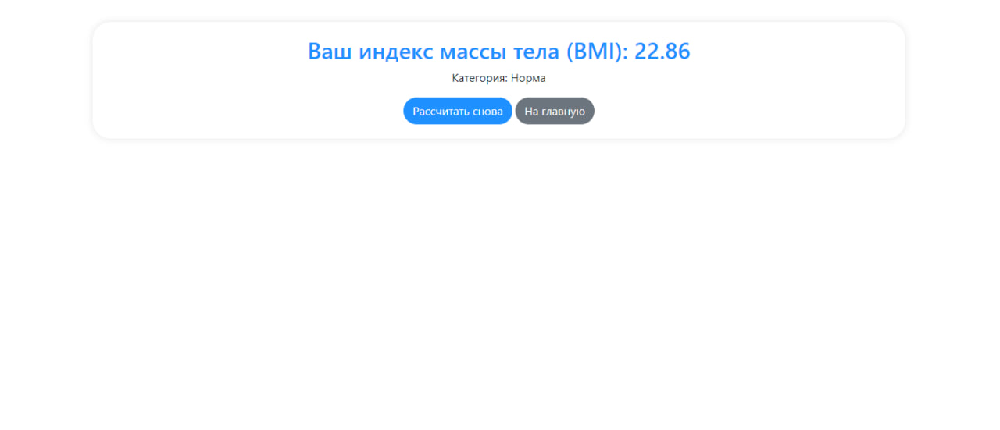
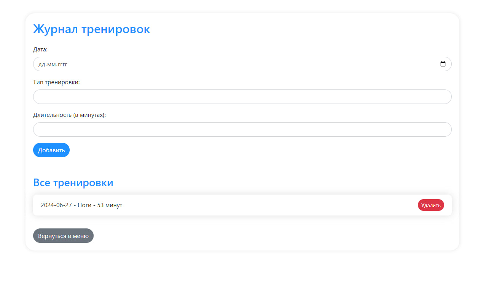
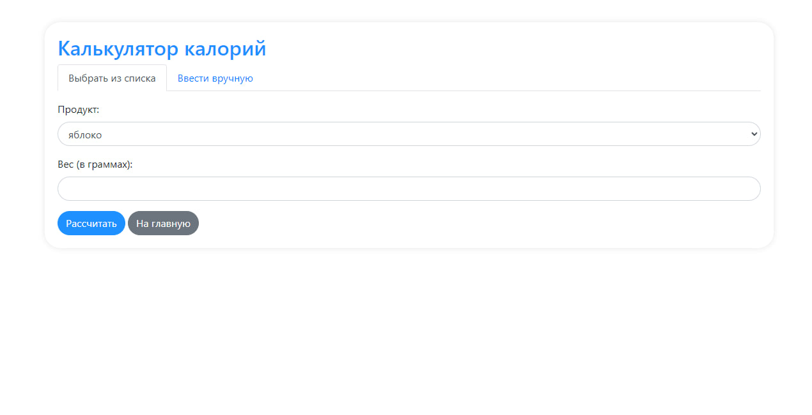
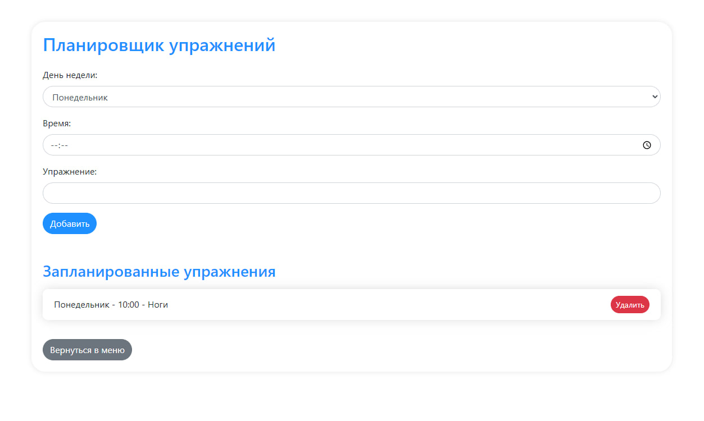

### Калькулятор фитнес-приложения на Flask

Это репозиторий содержит Flask-приложение для учета калорий, тренировок, планирования упражнений и расчета индекса массы тела (BMI).

Приложение представлено в двух видах: Flask веб-приложение и консольное приложение.

### Установка приложения на компьютер

Для установки приложения выполните следующие шаги:

1. **Склонируйте репозиторий:**
   ```bash
   git clone https://github.com/krimchanin/fitnes-app
   cd fitnes-app
   ```

2. **Установите зависимости:**
   ```bash
   pip install -r requirements.txt
   ```

### Демонстрация работы приложения

После установки приложения вы можете ознакомиться с его функциональностью через следующие вкладки:

#### 1. **Главная страница**



#### 2. **Рассчитать индекс массы тела (BMI)**



#### 3. **Вести журнал тренировок**



#### 4. **Калькулятор калорий**



#### 5. **Планировщик упражнений**



### Важная информация

**Предупреждение:** Пожалуйста, не используйте одновременно `console_app.py` и `app.py`, так как они могут взаимодействовать с одними и теми же файлами сохранений. Это может привести к некорректному отображению данных. Перед переключением между версиями приложения удалите файлы с расширением `.log`.

### Запуск приложения

Для запуска Flask-приложения выполните:
```bash
python app.py
```
Приложение будет доступно по адресу `http://127.0.0.1:5000/`.

Для запуска консольного-приложения выполните:
```bash
python console_app.py
```
Приложение будет доступно в терминале.

Это приложение предоставляет удобные инструменты для учета калорий, планирования тренировок и управления планами упражнений.
